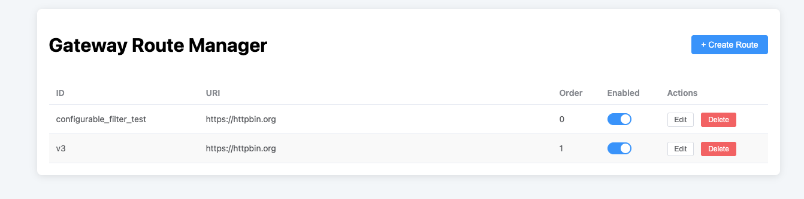
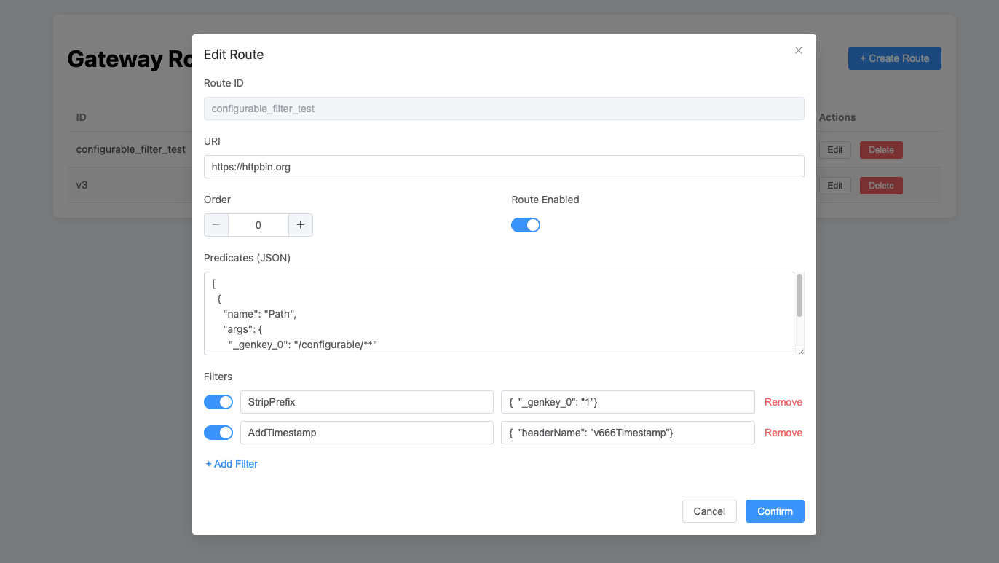

### 1: Admin Panel URL: http://localhost:8888/index.html
### 2: Admin Panel Examples:
FILTER List: 
FILTER Details: 
### 3: Database Script
```text
CREATE TABLE `gateway_routes` (
  `id` varchar(100) NOT NULL,
  `uri` text NOT NULL,
  `predicates` text NOT NULL,
  `filters` text,
  `route_order` int NOT NULL DEFAULT '0',
  `enabled` tinyint(1) NOT NULL DEFAULT '1',
  PRIMARY KEY (`id`)
) ENGINE=InnoDB

```
### 4: Configure a FILTER Test Case (Add V666Timestamp=timestamp to the request header) 
```text
 curl -X POST http://localhost:8888/admin/routes \
-H "Content-Type: application/json" \
-d '{
    "id": "configurable_filter_test",
    "uri": "https://httpbin.org",
    "predicates": [ { "name": "Path", "args": { "_genkey_0": "/configurable/**" } } ],
    "filters": [
        { "name": "StripPrefix", "args": { "_genkey_0": "1" } },
        {
            "name": "AddTimestamp",
            "args": {
                "headerName": "V666Timestamp"
            }
        }
    ]
}'
```
### 5: test filter
```text
curl http://localhost:8888/configurable/get

result:
{
  "args": {}, 
  "headers": {
    "Accept": "*/*", 
    "Content-Length": "0", 
    "Forwarded": "proto=http;host=\"localhost:8888\";for=\"[0:0:0:0:0:0:0:1]:60379\"", 
    "Host": "httpbin.org", 
    "User-Agent": "curl/8.7.1", 
    "V666Timestamp": "1757127853254", 
    "X-Amzn-Trace-Id": "Root=1-68bba4af-2ccc2aa45816b47f372d4386", 
    "X-Forwarded-Host": "localhost:8888", 
    "X-Forwarded-Prefix": "/configurable"
  }, 
  "origin": "0:0:0:0:0:0:0:1, 194.50.154.142", 
  "url": "https://localhost:8888/get"
}
```

## Unitization, Dual-Gateway Architecture Idea
##### Step 1: Define a "wildcard" route in the L1 Gateway In your route management service (e.g., route-manager), create a route rule for the L1 Gateway like this. Note that its uri is a meaningless placeholder because it will be overridden by our custom Filter.
```text
 {
 "id": "dynamic-unit-routing-rule",
 "uri": "lb://placeholder-service", // 占位符，无实际意义
 "order": 100,
 "predicates": [
 {
 "name": "Path",
 "args": {
 "patterns": "/api/**" // 匹配所有需要单元化路由的 API 请求
 }
 }
 ],
 "filters": [
 {
 "name": "UnitSelection", // 这是我们即将创建的自定义 Filter 的名字
 "args": {}
 }
 ]
 }
 
 ```
##### Step 2: Write a custom GatewayFilterFactory in the L1 Gateway project You need to create a new Java class in the L1 Gateway's codebase.
```
 Step 3: Performance Optimization - Introduce a High-Speed Cache Directly querying the database within the Filter is absolutely not feasible; it will bring down the entire gateway. You must implement a high-speed cache in the mappingService (e.g., using Caffeine or Guava Cache).•Caching Logic: The getUnitByTenantId method should first check the cache. If it's a cache miss, then query the database and put the result into the cache (with a reasonable expiration time, e.g., 5 minutes).•Cache Invalidation: When the mapping relationship in the database changes, there needs to be a mechanism to invalidate the cache (e.g., notifying the gateway to clear the cache via a message queue).The third layer is your business microservice cluster (order-service, user-service, etc.), and the L2 Gateway finds them through Service Discovery. Let's put the final piece of this puzzle together:Role Division: L2 Gateway and Service Discovery•L2 Gateway (In-Unit Gateway): It's the "traffic police" inside a unit. Its responsibility is to decide which business team (e.g., the "order service team") should handle the request based on the request path (/api/orders/**). However, it only knows the team's name (order-service-in-unit-a), not the specific members' locations (IP addresses and ports).•Service Discovery (e.g., Nacos, Eureka, Consul): It's the "address book" or "dynamic map" for the entire unit. When each microservice instance starts, it reports its address to the service discovery (e.g., "I am an instance of the 'order service team', and my address is 10.10.1.5:8080").L2 Gateway's Routing Rules (Key Point) The routing rules of the L2 Gateway have a fundamental difference from L1's: the uri format. It uses the lb:// protocol, where lb stands for Load Balancer. In the L2 Gateway's route configuration, the rule looks like this:
 {
 "id": "route-to-orders-service-in-unit-a",
 "uri": "lb://order-service-in-unit-a", // 注意这里！
 "order": 1,
 "predicates": [
 {
 "name": "Path",
 "args": {
 "patterns": "/api/orders/**"
 }
 }
 ]
 }
 
 Connecting L1, L2, L3, and Service Discovery - A Complete Request Journey:
 1.[External Request] -> The client sends a request GET /api/orders/123, carrying the partition key X-Tenant-ID: tenant-1.
 2.[L1 Gateway] -> a. The custom Filter (UnitSelectionGatewayFilter) of the L1 Gateway captures the request. b. The Filter extracts tenant-1, queries the cache/database, and learns that tenant-1 belongs to unit LA. c. The Filter finds the corresponding L2 Gateway address for unit LA from the configuration, e.g., http://l2-gateway-of-unit-a.com. d. The L1 Gateway dynamically modifies the request target and forwards the request to the L2 Gateway.
 3.[L2 Gateway (Unit LA)] -> a. The L2 Gateway receives the request GET /api/orders/123. b. It performs a match in its own route table (loaded from its own Redis) and finds the rule above based on the path /api/orders/**. c. It sees that the target URI is "lb://order-service-in-unit-a".
 4.[L2 Gateway Interacts with Service Discovery] -> a. The service discovery module of Spring Cloud Gateway is activated. b. The L2 Gateway sends a query to the service discovery: "Hello, please tell me which healthy instances the service order-service-in-unit-a currently has." c. The service discovery replies with a list of addresses, e.g., [10.10.1.5:8080, 10.10.1.6:8080].
 5.[L2 Gateway Performs Load Balancing] -> a. The built-in load balancer of Spring Cloud Gateway (Spring Cloud LoadBalancer) selects an instance from the list, e.g., 10.10.1.5:8080 (using the round-robin strategy by default). b. The L2 Gateway finally forwards the request to http://10.10.1.5:8080/api/orders/123.
 6.[L3 Microservice] -> An instance of order-service-in-unit-a receives the request, executes the business logic, and then returns the response along the original path.
```

